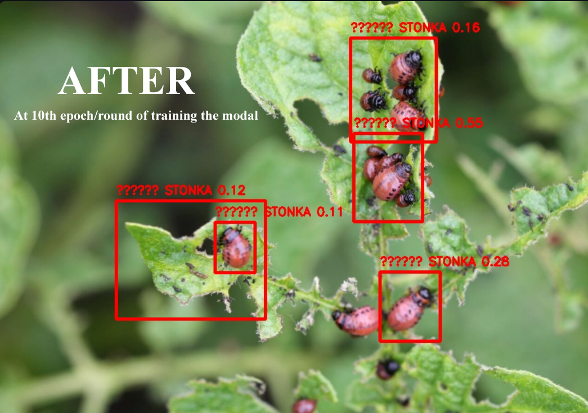

[](https://www.python.org/)
[](https://streamlit.io/)
[](https://ultralytics.com/)
[](https://github.com/Byadiso/Stonka-Hunter/commits/main)
[](https://github.com/Byadiso/Stonka-Hunter/actions)
[](https://opensource.org/licenses/MIT)


# 🐞 Stonka hunter 

**Stonka hunger** is a computer vision application built with **Streamlit** and **YOLOv8** designed to help farmers identify and track the Colorado Potato Beetle (*Leptinotarsa decemlineata*), commonly known as **Stonka**, in real-time.

[](assets/main_stonka.png)

## Key Features

* **AI-Powered Detection:** Uses a custom-trained YOLOv8 model to identify Beetles among 12 different insect classes.
* **Real-time Analysis:** Support for live camera input directly from the field or image uploads.
* **Environmental Context:** Integrated weather data and GPS/City-based location tracking to monitor field conditions.
* **Detection History:** Save identified pests with timestamps and review them in a built-in Gallery tab.
* **Adaptive Sensitivity:** Adjustable confidence thresholds to ensure detection even in difficult conditions (like frosted leaves).

## Getting Started

### 1. Prerequisites

* Python 3.8+
* An environment with a webcam (for live mode) or image attachment option.

### 2. Installation

Clone the repository and install the required dependencies:

```bash
git clone https://github.com/Byadiso/stonka-hunter.git
cd stonka-hunter
pip install -r requirements.txt

```

### 3. Project Structure

Ensure your model weights are in the correct directory:

```text
Stonka-App/
├── runs/detect/train/weights/best.pt  <-- Your trained model
├── detections/                         <-- Saved history folder
├── script.py                           <-- The main Streamlit app
└── stonka_dataset/                     <-- Dataset folder (optional)

```

### 4. Running the App

Start the Streamlit server:

```bash
streamlit run script.py

```

## How the AI Works

The model was trained using **YOLOv8n** on a dataset containing 12 insect classes:
`["Ants", "Bees", "Beetles", "Caterpillars", "Earthworms", "Earwigs", "Grasshoppers", "Moths", "Slugs", "Snails", "Wasps", "Weevils"]`

The app specifically triggers high-priority alerts when **Beetles or stonka** are detected, while simply identifying and counting other insect types.

## Built With

* [Ultralytics YOLOv8](https://github.com/ultralytics/ultralytics) - Real-time Object Detection
* [Streamlit](https://streamlit.io/) - Web Interface
* [Open-Meteo API](https://open-meteo.com/) - Weather Data
* [OpenCV](https://opencv.org/) - Image Processing

## Demo

Here’s a live detection example from the app:

[](assets/demo_detection.png)

## License

This project is licensed under the MIT License - see the LICENSE file for details.

---

## Dataset Attribution

The model used in this project was trained on the **AgroPest-12** dataset, which provides high-quality imagery for 12 common crop pests.

* **Dataset:** [Crop Pests Dataset (AgroPest-12)](https://www.kaggle.com/datasets/rupankarmajumdar/crop-pests-dataset/data)
* **Author:** Rupankar Majumdar
* **Citation:** > Majumdar, R. (2025). *AgroPest-12: A 12-Class Image Dataset of Crop Insects and Pests*. Kaggle.